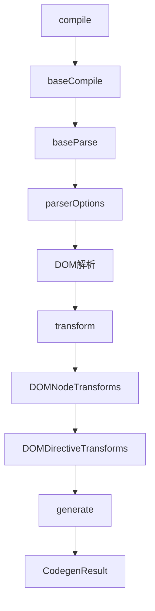
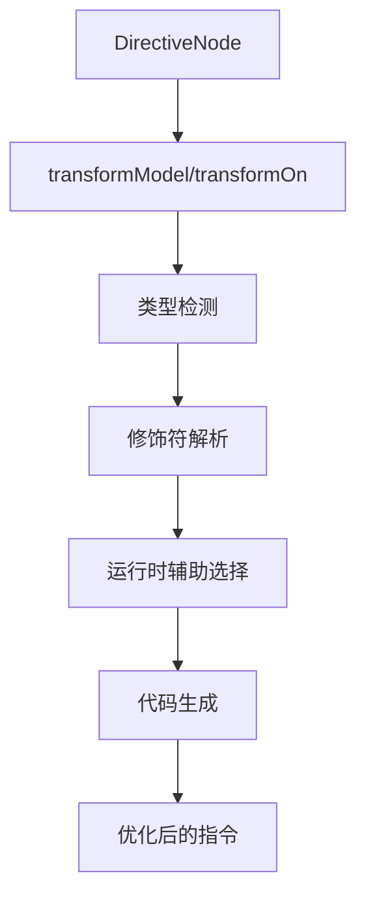
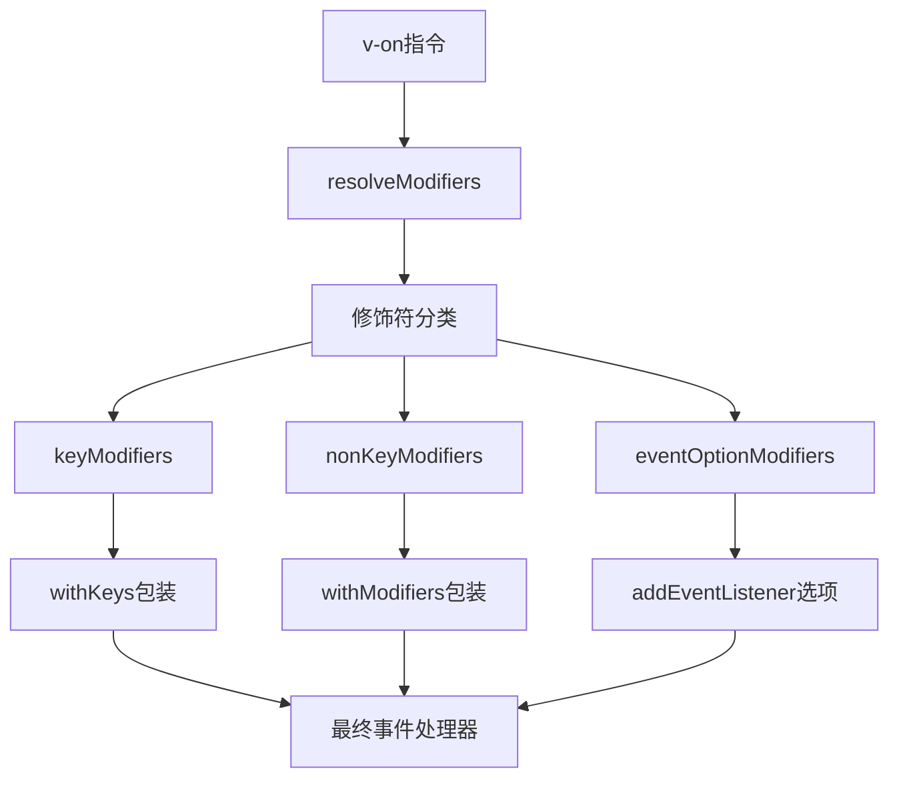

# Vue 3 DOM 编译器系统深度解析

## 概述

`@vue/compiler-dom` 是 Vue 3 编译器系统的 DOM 特定实现，负责将 Vue 模板编译为浏览器环境下的渲染函数。它基于 `@vue/compiler-core` 构建，添加了 DOM 特定的解析选项、节点转换器和指令转换器，为浏览器环境提供了完整的模板编译能力。

### 核心特性

- **DOM 特定解析**：支持 HTML、SVG、MathML 标签解析
- **指令转换**：实现 v-model、v-on、v-show 等 DOM 指令
- **样式处理**：内联样式解析和优化
- **事件系统**：事件修饰符和键盘事件处理
- **命名空间管理**：HTML/SVG/MathML 命名空间切换
- **静态优化**：静态内容字符串化和提升

## 核心架构设计

### 1. 编译器层（Compiler Layer）
```typescript
// 主编译函数
export function compile(
  src: string | RootNode,
  options: CompilerOptions = {},
): CodegenResult {
  return baseCompile(
    src,
    extend({}, parserOptions, options, {
      nodeTransforms: [
        ignoreSideEffectTags,
        ...DOMNodeTransforms,
        ...(options.nodeTransforms || []),
      ],
      directiveTransforms: extend(
        {},
        DOMDirectiveTransforms,
        options.directiveTransforms || {},
      ),
      transformHoist: __BROWSER__ ? null : stringifyStatic,
    }),
  )
}
```

### 2. 解析器层（Parser Layer）
```typescript
// DOM 特定解析选项
export const parserOptions: ParserOptions = {
  parseMode: 'html',
  isVoidTag,
  isNativeTag: tag => isHTMLTag(tag) || isSVGTag(tag) || isMathMLTag(tag),
  isPreTag: tag => tag === 'pre',
  isIgnoreNewlineTag: tag => tag === 'pre' || tag === 'textarea',
  decodeEntities: __BROWSER__ ? decodeHtmlBrowser : undefined,
  isBuiltInComponent,
  getNamespace,
}
```

### 3. 转换器层（Transform Layer）
```typescript
// 节点转换器
export const DOMNodeTransforms: NodeTransform[] = [
  transformStyle,
  ...(__DEV__ ? [transformTransition, validateHtmlNesting] : []),
]

// 指令转换器
export const DOMDirectiveTransforms: Record<string, DirectiveTransform> = {
  cloak: noopDirectiveTransform,
  html: transformVHtml,
  text: transformVText,
  model: transformModel,
  on: transformOn,
  show: transformShow,
}
```

### 4. 运行时辅助层（Runtime Helpers Layer）
```typescript
// 运行时辅助符号
export const V_MODEL_RADIO: unique symbol = Symbol('vModelRadio')
export const V_MODEL_CHECKBOX: unique symbol = Symbol('vModelCheckbox')
export const V_MODEL_TEXT: unique symbol = Symbol('vModelText')
export const V_MODEL_SELECT: unique symbol = Symbol('vModelSelect')
export const V_MODEL_DYNAMIC: unique symbol = Symbol('vModelDynamic')
```

## 核心模块详解

### 1. 解析选项模块（Parser Options）

#### 标签识别系统
```typescript
// 标签类型检查
const isNativeTag = (tag: string) => {
  return isHTMLTag(tag) || isSVGTag(tag) || isMathMLTag(tag)
}

// 内置组件识别
const isBuiltInComponent = (tag: string) => {
  if (tag === 'Transition' || tag === 'transition') {
    return TRANSITION
  } else if (tag === 'TransitionGroup' || tag === 'transition-group') {
    return TRANSITION_GROUP
  }
}
```

#### 命名空间管理
```typescript
// 命名空间解析逻辑
function getNamespace(tag: string, parent: ElementNode, rootNamespace: Namespace) {
  let ns = parent ? parent.ns : rootNamespace
  
  // MathML 命名空间处理
  if (parent && ns === Namespaces.MATH_ML) {
    if (parent.tag === 'annotation-xml') {
      if (tag === 'svg') return Namespaces.SVG
      // HTML 内容检测
      if (hasHtmlEncoding(parent)) ns = Namespaces.HTML
    }
  }
  
  // SVG 命名空间处理
  if (parent && ns === Namespaces.SVG) {
    if (isForeignObject(parent.tag)) {
      ns = Namespaces.HTML
    }
  }
  
  return ns
}
```

### 2. 指令转换系统

#### v-model 转换器
```typescript
export const transformModel: DirectiveTransform = (dir, node, context) => {
  const baseResult = baseTransform(dir, node, context)
  
  // 组件 v-model 直接返回
  if (node.tagType === ElementTypes.COMPONENT) {
    return baseResult
  }
  
  const { tag } = node
  let directiveToUse = V_MODEL_TEXT
  
  // 根据元素类型选择合适的 v-model 实现
  if (tag === 'input') {
    const type = findProp(node, 'type')
    if (type?.value) {
      switch (type.value.content) {
        case 'radio': directiveToUse = V_MODEL_RADIO; break
        case 'checkbox': directiveToUse = V_MODEL_CHECKBOX; break
        case 'file': 
          context.onError(createDOMCompilerError(
            DOMErrorCodes.X_V_MODEL_ON_FILE_INPUT_ELEMENT
          ))
          break
      }
    }
  } else if (tag === 'select') {
    directiveToUse = V_MODEL_SELECT
  }
  
  return { ...baseResult, directiveToUse }
}
```

#### v-on 转换器
```typescript
export const transformOn: DirectiveTransform = (dir, node, context) => {
  const { modifiers } = dir
  
  // 修饰符分类
  const {
    keyModifiers,
    nonKeyModifiers,
    eventOptionModifiers
  } = resolveModifiers(dir.arg, modifiers, context, dir.loc)
  
  // 事件处理函数包装
  if (keyModifiers.length) {
    dir.exp = createCallExpression(V_ON_WITH_KEYS, [dir.exp, keyModifiers])
  }
  
  if (nonKeyModifiers.length) {
    dir.exp = createCallExpression(V_ON_WITH_MODIFIERS, [dir.exp, nonKeyModifiers])
  }
  
  return baseTransform(dir, node, context)
}
```

### 3. 样式转换系统

#### 内联样式解析
```typescript
export const transformStyle: NodeTransform = node => {
  if (node.type === NodeTypes.ELEMENT) {
    node.props.forEach((p, i) => {
      if (p.type === NodeTypes.ATTRIBUTE && p.name === 'style' && p.value) {
        // 将静态样式转换为动态绑定
        node.props[i] = {
          type: NodeTypes.DIRECTIVE,
          name: 'bind',
          arg: createSimpleExpression('style', true, p.loc),
          exp: parseInlineCSS(p.value.content, p.loc),
          modifiers: [],
          loc: p.loc,
        }
      }
    })
  }
}

// CSS 解析函数
const parseInlineCSS = (cssText: string, loc: SourceLocation) => {
  const normalized = parseStringStyle(cssText)
  return createSimpleExpression(
    JSON.stringify(normalized),
    false,
    loc,
    ConstantTypes.CAN_STRINGIFY,
  )
}
```

### 4. 事件修饰符系统

#### 修饰符分类算法
```typescript
const resolveModifiers = (
  key: ExpressionNode,
  modifiers: SimpleExpressionNode[],
  context: TransformContext,
  loc: SourceLocation,
) => {
  const keyModifiers = []
  const nonKeyModifiers = []
  const eventOptionModifiers = []
  
  for (const modifier of modifiers) {
    const name = modifier.content
    
    if (isEventOptionModifier(name)) {
      // .passive, .once, .capture
      eventOptionModifiers.push(name)
    } else if (maybeKeyModifier(name)) {
      // .left, .right 可能是键盘或鼠标修饰符
      if (isKeyboardEvent(key)) {
        keyModifiers.push(name)
      } else {
        nonKeyModifiers.push(name)
      }
    } else if (isNonKeyModifier(name)) {
      // .stop, .prevent, .self 等
      nonKeyModifiers.push(name)
    } else {
      // 键盘修饰符
      keyModifiers.push(name)
    }
  }
  
  return { keyModifiers, nonKeyModifiers, eventOptionModifiers }
}
```

## 核心算法解析

### 1. 命名空间切换算法

#### 上下文感知的命名空间解析
```typescript
class NamespaceResolver {
  resolve(tag: string, parent: ElementNode, root: Namespace): Namespace {
    // 1. 继承父级命名空间
    let namespace = parent?.ns || root
    
    // 2. MathML 特殊处理
    if (this.isMathMLContext(parent, namespace)) {
      namespace = this.resolveMathMLNamespace(tag, parent)
    }
    
    // 3. SVG 特殊处理
    if (this.isSVGContext(parent, namespace)) {
      namespace = this.resolveSVGNamespace(tag, parent)
    }
    
    // 4. 根据标签切换命名空间
    return this.switchNamespaceByTag(tag, namespace)
  }
  
  private resolveMathMLNamespace(tag: string, parent: ElementNode): Namespace {
    if (parent.tag === 'annotation-xml') {
      if (tag === 'svg') return Namespaces.SVG
      if (this.hasHtmlEncoding(parent)) return Namespaces.HTML
    }
    
    if (this.isMathMLTextElement(parent.tag) && !this.isMathMLSymbol(tag)) {
      return Namespaces.HTML
    }
    
    return Namespaces.MATH_ML
  }
}
```

### 2. 指令优化算法

#### v-model 类型推断
```typescript
class VModelOptimizer {
  optimize(node: ElementNode, dir: DirectiveNode): DirectiveTransform {
    const inputType = this.getInputType(node)
    
    // 静态类型优化
    if (inputType.isStatic) {
      return this.getStaticVModelTransform(inputType.value)
    }
    
    // 动态类型处理
    if (inputType.isDynamic) {
      return V_MODEL_DYNAMIC
    }
    
    // 默认文本类型
    return V_MODEL_TEXT
  }
  
  private getStaticVModelTransform(type: string): symbol {
    const typeMap = {
      'radio': V_MODEL_RADIO,
      'checkbox': V_MODEL_CHECKBOX,
      'select': V_MODEL_SELECT,
      'textarea': V_MODEL_TEXT,
    }
    
    return typeMap[type] || V_MODEL_TEXT
  }
}
```

### 3. 事件优化算法

#### 修饰符合并策略
```typescript
class EventModifierOptimizer {
  optimize(modifiers: string[], eventType: string): OptimizedEvent {
    const groups = this.groupModifiers(modifiers)
    
    // 编译时优化
    if (this.canOptimizeAtCompileTime(groups, eventType)) {
      return this.createOptimizedEvent(groups)
    }
    
    // 运行时处理
    return this.createRuntimeEvent(groups)
  }
  
  private groupModifiers(modifiers: string[]) {
    return {
      keys: modifiers.filter(m => this.isKeyModifier(m)),
      system: modifiers.filter(m => this.isSystemModifier(m)),
      mouse: modifiers.filter(m => this.isMouseModifier(m)),
      options: modifiers.filter(m => this.isEventOption(m)),
    }
  }
}
```

## 性能优化策略

### 1. 编译时优化

#### 静态分析优化
```typescript
class CompileTimeOptimizer {
  // 静态样式提升
  hoistStaticStyles(node: ElementNode): void {
    const styleAttr = this.findStyleAttribute(node)
    if (styleAttr && this.isStaticStyle(styleAttr)) {
      this.hoistToStatic(styleAttr)
    }
  }
  
  // 事件监听器优化
  optimizeEventListeners(node: ElementNode): void {
    const events = this.getEventDirectives(node)
    events.forEach(event => {
      if (this.isStaticHandler(event)) {
        this.cacheEventHandler(event)
      }
    })
  }
  
  // 指令合并
  mergeDirectives(directives: DirectiveNode[]): DirectiveNode[] {
    const groups = this.groupDirectivesByType(directives)
    return groups.map(group => this.mergeDirectiveGroup(group))
  }
}
```

### 2. 运行时优化

#### 缓存策略
```typescript
class RuntimeOptimizer {
  // 事件处理器缓存
  private eventCache = new WeakMap()
  
  cacheEventHandler(element: Element, event: string, handler: Function): void {
    const key = `${event}:${handler.toString()}`
    if (!this.eventCache.has(element)) {
      this.eventCache.set(element, new Map())
    }
    this.eventCache.get(element).set(key, handler)
  }
  
  // 样式对象缓存
  private styleCache = new Map()
  
  cacheStyleObject(cssText: string): StyleObject {
    if (!this.styleCache.has(cssText)) {
      this.styleCache.set(cssText, parseStringStyle(cssText))
    }
    return this.styleCache.get(cssText)
  }
}
```

### 3. 内存优化

#### 对象池管理
```typescript
class ObjectPoolManager {
  private nodePool: ElementNode[] = []
  private directivePool: DirectiveNode[] = []
  
  acquireNode(): ElementNode {
    return this.nodePool.pop() || this.createNode()
  }
  
  releaseNode(node: ElementNode): void {
    this.resetNode(node)
    this.nodePool.push(node)
  }
  
  private resetNode(node: ElementNode): void {
    node.props.length = 0
    node.children.length = 0
    node.directives?.length && (node.directives.length = 0)
  }
}
```

## 函数调用链分析

### 1. 模板编译流程



### 2. 指令转换流程



### 3. 事件处理流程



## 企业级应用建议

### 1. 性能优化

#### 编译优化配置
```typescript
// 生产环境编译配置
const productionCompilerOptions = {
  // 启用静态提升
  hoistStatic: true,
  
  // 缓存事件处理器
  cacheHandlers: true,
  
  // 优化指令
  directiveTransforms: {
    // 自定义指令优化
    'my-directive': optimizeMyDirective,
  },
  
  // 移除开发时检查
  isProduction: true,
}

// 开发环境配置
const developmentCompilerOptions = {
  // 保留源码映射
  sourceMap: true,
  
  // 启用详细错误信息
  onError: (error) => {
    console.error('编译错误:', error)
  },
  
  // 启用 HTML 嵌套验证
  nodeTransforms: [
    ...DOMNodeTransforms,
    validateHtmlNesting,
  ],
}
```

### 2. 自定义指令开发

#### 指令转换器模板
```typescript
// 自定义指令转换器
export const transformCustomDirective: DirectiveTransform = (
  dir,
  node,
  context
) => {
  // 1. 参数验证
  if (!dir.exp) {
    context.onError(createCompilerError(
      ErrorCodes.X_DIRECTIVE_MISSING_EXPRESSION,
      dir.loc
    ))
    return { props: [] }
  }
  
  // 2. 类型检查
  if (node.tagType !== ElementTypes.ELEMENT) {
    context.onError(createCompilerError(
      ErrorCodes.X_DIRECTIVE_ON_COMPONENT,
      dir.loc
    ))
    return { props: [] }
  }
  
  // 3. 代码生成
  return {
    props: [
      createObjectProperty(
        createSimpleExpression('onCustom', true),
        dir.exp
      )
    ]
  }
}
```

### 3. 错误处理策略

#### 编译错误处理
```typescript
class CompilerErrorHandler {
  private errors: CompilerError[] = []
  
  handleError(error: CompilerError): void {
    // 错误分类
    if (this.isCriticalError(error)) {
      throw error
    }
    
    // 记录警告
    this.errors.push(error)
    
    // 开发环境提示
    if (__DEV__) {
      console.warn(`编译警告: ${error.message}`, {
        code: error.code,
        location: error.loc,
        suggestions: this.getSuggestions(error)
      })
    }
  }
  
  private getSuggestions(error: CompilerError): string[] {
    const suggestionMap = {
      [DOMErrorCodes.X_V_MODEL_ON_FILE_INPUT_ELEMENT]: [
        '文件输入不支持 v-model',
        '请使用 @change 事件处理文件选择'
      ],
      [DOMErrorCodes.X_V_MODEL_ARG_ON_ELEMENT]: [
        '原生元素不支持 v-model 参数',
        '请移除 v-model 的参数'
      ]
    }
    
    return suggestionMap[error.code] || []
  }
}
```

### 4. 调试工具

#### 编译过程可视化
```typescript
class CompilerDebugger {
  private steps: CompilationStep[] = []
  
  logStep(step: string, data: any): void {
    if (__DEV__) {
      this.steps.push({
        step,
        timestamp: Date.now(),
        data: JSON.parse(JSON.stringify(data))
      })
    }
  }
  
  visualizeAST(ast: RootNode): void {
    if (__DEV__) {
      console.group('AST 结构')
      this.printNode(ast, 0)
      console.groupEnd()
    }
  }
  
  private printNode(node: any, depth: number): void {
    const indent = '  '.repeat(depth)
    console.log(`${indent}${node.type}: ${node.tag || node.content || ''}`)
    
    if (node.children) {
      node.children.forEach(child => this.printNode(child, depth + 1))
    }
  }
}
```

Vue 3 的 compiler-dom 模块通过精心设计的架构和优化策略，为浏览器环境提供了高效、灵活的模板编译能力。其模块化的设计使得开发者可以轻松扩展和定制编译行为，同时保持了出色的性能表现。