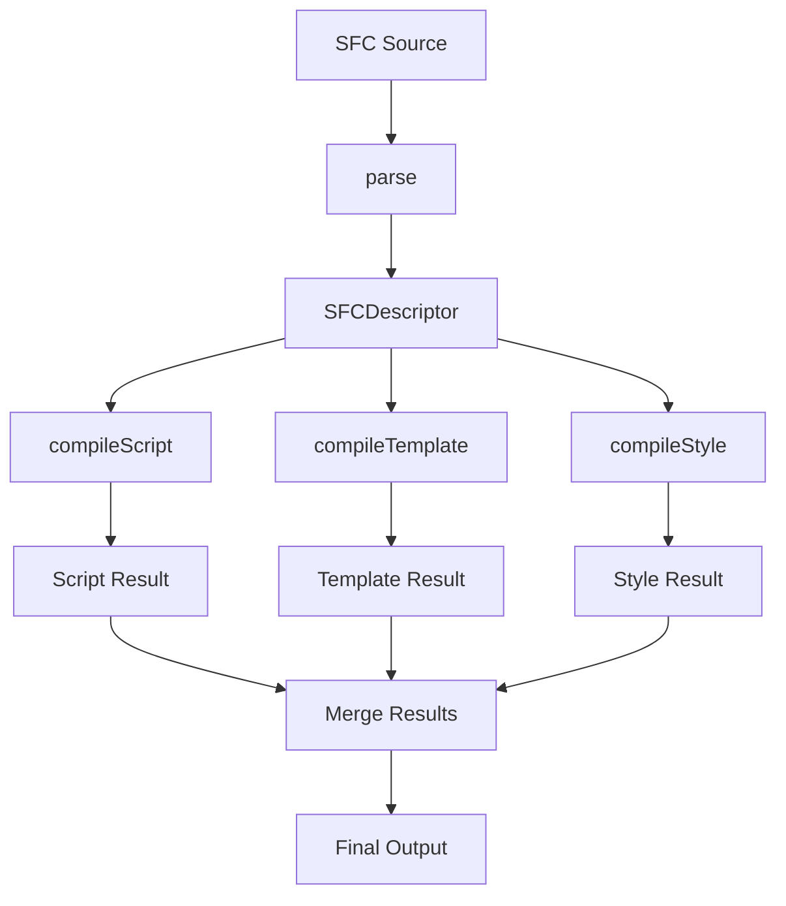
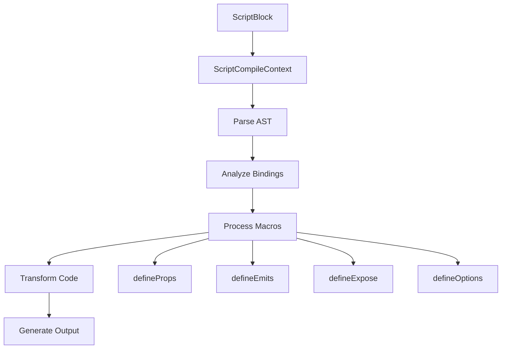
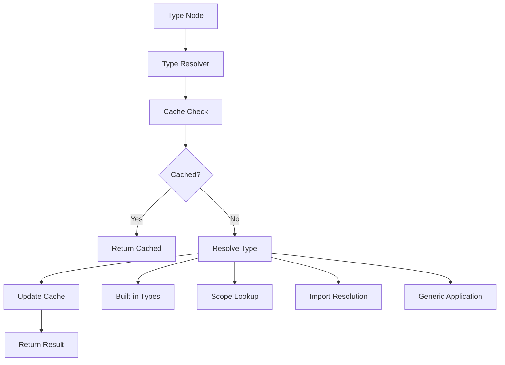

# Vue 3 单文件组件编译器深度解析

## 概述

`@vue/compiler-sfc` 是 Vue 3 单文件组件（SFC）编译器的核心实现，负责将 `.vue` 文件解析并编译为可执行的 JavaScript 代码。它处理模板、脚本、样式三个部分的编译，并提供了完整的类型推断、作用域样式、CSS 变量注入等高级功能。

### 核心特性

- **SFC 解析**：完整的 `.vue` 文件解析和 AST 生成
- **脚本编译**：支持 `<script setup>` 语法糖和宏函数
- **模板编译**：集成 DOM 编译器，支持资源 URL 转换
- **样式编译**：作用域样式、CSS 模块、CSS 变量注入
- **类型推断**：TypeScript 类型分析和运行时类型生成
- **HMR 支持**：热模块替换的依赖分析和缓存管理
- **源码映射**：完整的 Source Map 支持

## 核心架构设计

### 1. 解析层（Parse Layer）
```typescript
// SFC 描述符结构
export interface SFCDescriptor {
  filename: string
  source: string
  template: SFCTemplateBlock | null
  script: SFCScriptBlock | null
  scriptSetup: SFCScriptBlock | null
  styles: SFCStyleBlock[]
  customBlocks: SFCBlock[]
  cssVars: string[]
  slotted: boolean
  shouldForceReload: (prevImports: Record<string, ImportBinding>) => boolean
}

// 解析函数
export function parse(
  source: string,
  options: SFCParseOptions = {}
): SFCParseResult {
  const descriptor = parseDescriptor(source, options)
  return {
    descriptor,
    errors: validateDescriptor(descriptor)
  }
}
```

### 2. 编译层（Compile Layer）
```typescript
// 脚本编译
export function compileScript(
  sfc: SFCDescriptor,
  options: SFCScriptCompileOptions
): SFCScriptBlock {
  const ctx = new ScriptCompileContext(sfc, options)
  return processScript(ctx)
}

// 模板编译
export function compileTemplate(
  options: SFCTemplateCompileOptions
): SFCTemplateCompileResults {
  return processTemplate(options)
}

// 样式编译
export function compileStyle(
  options: SFCStyleCompileOptions
): SFCStyleCompileResults {
  return processStyle(options)
}
```

### 3. 上下文层（Context Layer）
```typescript
// 编译上下文
export class ScriptCompileContext {
  // 语言检测
  isJS: boolean
  isTS: boolean
  isCE: boolean
  
  // AST 管理
  scriptAst: Program | null
  scriptSetupAst: Program | null
  
  // 源码操作
  source: string
  s: MagicString
  
  // 绑定分析
  bindingMetadata: BindingMetadata
  userImports: Record<string, ImportBinding>
  
  // 宏函数状态
  hasDefinePropsCall: boolean
  hasDefineEmitCall: boolean
  hasDefineExposeCall: boolean
}
```

### 4. 转换层（Transform Layer）
```typescript
// 资源 URL 转换
export function transformAssetUrl(
  node: ElementNode,
  context: TransformContext,
  options: AssetURLOptions
): void {
  // 处理静态资源引用
}

// 作用域样式转换
export function transformScopedCSS(
  css: string,
  id: string,
  options: ScopedCSSOptions
): string {
  // 添加作用域标识符
}
```

## 核心模块详解

### 1. SFC 解析模块（Parse Module）

#### 块解析算法
```typescript
class SFCParser {
  parse(source: string, options: SFCParseOptions): SFCDescriptor {
    const ast = this.parseHTML(source)
    const blocks = this.extractBlocks(ast)
    
    return {
      template: this.parseTemplateBlock(blocks.template),
      script: this.parseScriptBlock(blocks.script),
      scriptSetup: this.parseScriptSetupBlock(blocks.scriptSetup),
      styles: blocks.styles.map(s => this.parseStyleBlock(s)),
      customBlocks: blocks.custom.map(c => this.parseCustomBlock(c))
    }
  }
  
  private extractBlocks(ast: RootNode): BlockCollection {
    const blocks = {
      template: null,
      script: null,
      scriptSetup: null,
      styles: [],
      custom: []
    }
    
    for (const node of ast.children) {
      if (node.type === NodeTypes.ELEMENT) {
        this.classifyBlock(node, blocks)
      }
    }
    
    return blocks
  }
}
```

#### 源码映射生成
```typescript
class SourceMapGenerator {
  generate(descriptor: SFCDescriptor): RawSourceMap {
    const map = new SourceMapGenerator({
      file: descriptor.filename,
      sourceRoot: options.sourceRoot
    })
    
    // 为每个块生成映射
    this.mapTemplateBlock(descriptor.template, map)
    this.mapScriptBlocks(descriptor.script, descriptor.scriptSetup, map)
    this.mapStyleBlocks(descriptor.styles, map)
    
    return map.toJSON()
  }
  
  private mapTemplateBlock(block: SFCTemplateBlock, map: SourceMapGenerator): void {
    if (!block) return
    
    const lines = block.content.split('\n')
    lines.forEach((line, index) => {
      map.addMapping({
        source: block.loc.source,
        original: { line: block.loc.start.line + index, column: 0 },
        generated: { line: index + 1, column: 0 }
      })
    })
  }
}
```

### 2. 脚本编译模块（Script Compile Module）

#### 宏函数处理系统
```typescript
class MacroProcessor {
  processDefineProps(ctx: ScriptCompileContext, node: CallExpression): void {
    // 1. 类型分析
    const typeDecl = this.extractTypeDeclaration(node)
    
    // 2. 运行时声明生成
    const runtimeDecl = this.generateRuntimeProps(typeDecl)
    
    // 3. 绑定元数据更新
    this.updateBindingMetadata(ctx, runtimeDecl)
    
    // 4. 代码替换
    ctx.s.overwrite(
      node.start!,
      node.end!,
      this.generatePropsCode(runtimeDecl)
    )
  }
  
  processDefineEmits(ctx: ScriptCompileContext, node: CallExpression): void {
    const emitsDecl = this.analyzeEmitsDeclaration(node)
    
    // 生成运行时 emits 选项
    const runtimeEmits = this.generateRuntimeEmits(emitsDecl)
    
    // 更新上下文
    ctx.emitsRuntimeDecl = runtimeEmits
    ctx.hasDefineEmitCall = true
  }
  
  processDefineExpose(ctx: ScriptCompileContext, node: CallExpression): void {
    // 分析暴露的属性
    const exposeDecl = this.analyzeExposeDeclaration(node)
    
    // 生成 expose 调用
    const exposeCode = this.generateExposeCode(exposeDecl)
    
    ctx.s.appendLeft(ctx.endOffset!, exposeCode)
  }
}
```

#### 类型推断引擎
```typescript
class TypeInferenceEngine {
  inferPropsType(node: Node, ctx: ScriptCompileContext): PropsType {
    if (node.type === 'TSTypeReference') {
      return this.resolveTypeReference(node, ctx)
    }
    
    if (node.type === 'TSTypeLiteral') {
      return this.inferFromTypeLiteral(node)
    }
    
    if (node.type === 'TSInterfaceDeclaration') {
      return this.inferFromInterface(node)
    }
    
    return { type: 'unknown' }
  }
  
  private resolveTypeReference(node: TSTypeReference, ctx: ScriptCompileContext): PropsType {
    const typeName = this.getTypeName(node)
    
    // 查找类型定义
    const typeDecl = ctx.scope?.getType(typeName)
    if (typeDecl) {
      return this.inferPropsType(typeDecl, ctx)
    }
    
    // 查找导入的类型
    const importBinding = ctx.userImports[typeName]
    if (importBinding?.isType) {
      return this.resolveImportedType(importBinding, ctx)
    }
    
    return { type: 'unknown' }
  }
}
```

### 3. 模板编译模块（Template Compile Module）

#### 资源 URL 转换
```typescript
export function transformAssetUrl(
  node: ElementNode,
  context: TransformContext,
  options: AssetURLOptions = {}
): void {
  const tags = options.tags || DEFAULT_ASSET_URL_OPTIONS.tags
  
  for (const tag in tags) {
    if (node.tag === tag) {
      const attributes = tags[tag]
      
      for (const attr of attributes) {
        this.transformAttribute(node, attr, context, options)
      }
    }
  }
}

class AssetURLTransformer {
  transformAttribute(
    node: ElementNode,
    attrName: string,
    context: TransformContext,
    options: AssetURLOptions
  ): void {
    const attr = this.findAttribute(node, attrName)
    if (!attr || !attr.value) return
    
    const url = attr.value.content
    
    // 检查是否需要转换
    if (this.shouldTransform(url, options)) {
      const transformedUrl = this.transformURL(url, options)
      
      // 替换为动态导入
      attr.value = createSimpleExpression(
        `_imports_${this.getImportIndex(transformedUrl)}`,
        false
      )
      
      // 添加导入语句
      context.addImport(transformedUrl)
    }
  }
  
  private shouldTransform(url: string, options: AssetURLOptions): boolean {
    // 跳过外部 URL
    if (/^https?:\/\//.test(url)) return false
    
    // 跳过 data URL
    if (/^data:/.test(url)) return false
    
    // 检查包含/排除规则
    if (options.includeAbsolute === false && /^\//.test(url)) return false
    
    return true
  }
}
```

#### Srcset 转换
```typescript
export function transformSrcset(
  node: ElementNode,
  context: TransformContext
): void {
  const srcsetAttr = findProp(node, 'srcset')
  if (!srcsetAttr || !srcsetAttr.value) return
  
  const srcsetValue = srcsetAttr.value.content
  const transformedSrcset = this.processSrcset(srcsetValue, context)
  
  srcsetAttr.value = createSimpleExpression(
    transformedSrcset,
    false
  )
}

class SrcsetProcessor {
  processSrcset(srcset: string, context: TransformContext): string {
    return srcset.replace(
      /([^\s,]+)(\s+[^,]*)?/g,
      (match, url, descriptor) => {
        const transformedUrl = this.transformURL(url, context)
        return `${transformedUrl}${descriptor || ''}`
      }
    )
  }
}
```

### 4. 样式编译模块（Style Compile Module）

#### 作用域样式处理
```typescript
class ScopedCSSProcessor {
  process(css: string, id: string, options: ScopedCSSOptions): string {
    const ast = this.parseCSS(css)
    const scopedAST = this.transformAST(ast, id, options)
    return this.generateCSS(scopedAST)
  }
  
  private transformAST(ast: CSSNode, id: string, options: ScopedCSSOptions): CSSNode {
    return this.walkRules(ast, (rule) => {
      if (rule.type === 'rule') {
        rule.selectors = rule.selectors.map(selector => 
          this.scopeSelector(selector, id, options)
        )
      }
      
      if (rule.type === 'atrule' && rule.name === 'keyframes') {
        rule.params = this.scopeKeyframes(rule.params, id)
      }
    })
  }
  
  private scopeSelector(selector: string, id: string, options: ScopedCSSOptions): string {
    // 处理 :deep() 伪类
    if (selector.includes(':deep(')) {
      return this.processDeepSelector(selector, id)
    }
    
    // 处理 :slotted() 伪类
    if (selector.includes(':slotted(')) {
      return this.processSlottedSelector(selector, id)
    }
    
    // 处理 :global() 伪类
    if (selector.includes(':global(')) {
      return this.processGlobalSelector(selector)
    }
    
    // 普通选择器添加作用域
    return this.addScopeToSelector(selector, id)
  }
}
```

#### CSS 变量注入
```typescript
class CSSVarsInjector {
  inject(css: string, vars: string[], id: string): string {
    const injectedVars = this.generateCSSVars(vars, id)
    return `${injectedVars}\n${css}`
  }
  
  private generateCSSVars(vars: string[], id: string): string {
    const varDeclarations = vars.map(varName => {
      const hashedName = this.hashVarName(varName, id)
      return `  --${hashedName}: var(--${varName});`
    }).join('\n')
    
    return `:root {\n${varDeclarations}\n}`
  }
  
  extractCSSVars(descriptor: SFCDescriptor): string[] {
    const vars = new Set<string>()
    
    // 从模板中提取
    if (descriptor.template) {
      this.extractFromTemplate(descriptor.template.ast, vars)
    }
    
    // 从脚本中提取
    if (descriptor.scriptSetup) {
      this.extractFromScript(descriptor.scriptSetup.scriptSetupAst, vars)
    }
    
    return Array.from(vars)
  }
}
```

## 核心算法解析

### 1. 依赖分析算法

#### 导入使用检查
```typescript
class ImportUsageAnalyzer {
  analyze(ast: Program, imports: Record<string, ImportBinding>): Set<string> {
    const usedImports = new Set<string>()
    
    this.walkAST(ast, {
      Identifier: (node) => {
        if (imports[node.name]) {
          usedImports.add(node.name)
        }
      },
      
      MemberExpression: (node) => {
        if (node.object.type === 'Identifier' && imports[node.object.name]) {
          usedImports.add(node.object.name)
        }
      },
      
      CallExpression: (node) => {
        if (node.callee.type === 'Identifier' && imports[node.callee.name]) {
          usedImports.add(node.callee.name)
        }
      }
    })
    
    return usedImports
  }
  
  checkTemplateUsage(template: RootNode, imports: Record<string, ImportBinding>): Set<string> {
    const usedImports = new Set<string>()
    
    this.walkTemplate(template, (node) => {
      if (node.type === NodeTypes.SIMPLE_EXPRESSION) {
        const identifiers = this.extractIdentifiers(node.content)
        identifiers.forEach(id => {
          if (imports[id]) {
            usedImports.add(id)
          }
        })
      }
    })
    
    return usedImports
  }
}
```

### 2. 类型解析算法

#### 递归类型解析
```typescript
class TypeResolver {
  resolve(node: Node, scope: TypeScope): ResolvedType {
    const cache = this.getCache(node)
    if (cache) return cache
    
    const resolved = this.doResolve(node, scope)
    this.setCache(node, resolved)
    
    return resolved
  }
  
  private doResolve(node: Node, scope: TypeScope): ResolvedType {
    switch (node.type) {
      case 'TSTypeReference':
        return this.resolveTypeReference(node, scope)
      
      case 'TSUnionType':
        return this.resolveUnionType(node, scope)
      
      case 'TSIntersectionType':
        return this.resolveIntersectionType(node, scope)
      
      case 'TSTypeLiteral':
        return this.resolveTypeLiteral(node, scope)
      
      case 'TSArrayType':
        return this.resolveArrayType(node, scope)
      
      default:
        return { type: 'unknown' }
    }
  }
  
  private resolveTypeReference(node: TSTypeReference, scope: TypeScope): ResolvedType {
    const typeName = this.getTypeName(node)
    
    // 内置类型
    if (this.isBuiltinType(typeName)) {
      return this.getBuiltinType(typeName)
    }
    
    // 作用域查找
    const typeDecl = scope.getType(typeName)
    if (typeDecl) {
      return this.resolve(typeDecl, scope)
    }
    
    // 泛型参数
    if (node.typeParameters) {
      const args = node.typeParameters.params.map(param => 
        this.resolve(param, scope)
      )
      return this.applyGenericArgs(typeName, args)
    }
    
    return { type: 'unknown' }
  }
}
```

### 3. 代码生成算法

#### 渐进式代码构建
```typescript
class CodeGenerator {
  generate(ctx: ScriptCompileContext): string {
    const parts = []
    
    // 1. 导入语句
    parts.push(this.generateImports(ctx))
    
    // 2. 类型声明
    if (ctx.isTS) {
      parts.push(this.generateTypeDeclarations(ctx))
    }
    
    // 3. 组件选项
    parts.push(this.generateComponentOptions(ctx))
    
    // 4. setup 函数
    if (ctx.descriptor.scriptSetup) {
      parts.push(this.generateSetupFunction(ctx))
    }
    
    // 5. 导出语句
    parts.push(this.generateExports(ctx))
    
    return parts.filter(Boolean).join('\n\n')
  }
  
  private generateSetupFunction(ctx: ScriptCompileContext): string {
    const setupBody = []
    
    // Props 解构
    if (ctx.propsDestructureDecl) {
      setupBody.push(this.generatePropsDestructure(ctx))
    }
    
    // 响应式声明
    setupBody.push(this.generateReactiveDeclarations(ctx))
    
    // 用户代码
    setupBody.push(this.getUserCode(ctx))
    
    // 返回语句
    setupBody.push(this.generateReturnStatement(ctx))
    
    return `function setup(${this.getSetupParams(ctx)}) {\n${setupBody.join('\n')}\n}`
  }
}
```

## 性能优化策略

### 1. 编译时优化

#### 静态分析缓存
```typescript
class CompilationCache {
  private parseCache = new LRUCache<string, SFCParseResult>(100)
  private typeCache = new Map<string, ResolvedType>()
  
  getCachedParse(source: string, options: SFCParseOptions): SFCParseResult | null {
    const key = this.generateCacheKey(source, options)
    return this.parseCache.get(key) || null
  }
  
  setCachedParse(source: string, options: SFCParseOptions, result: SFCParseResult): void {
    const key = this.generateCacheKey(source, options)
    this.parseCache.set(key, result)
  }
  
  invalidateTypeCache(filename: string): void {
    // 清除相关类型缓存
    for (const [key] of this.typeCache) {
      if (key.includes(filename)) {
        this.typeCache.delete(key)
      }
    }
  }
}
```

#### 增量编译
```typescript
class IncrementalCompiler {
  compile(descriptor: SFCDescriptor, prevDescriptor?: SFCDescriptor): CompileResult {
    const changes = this.detectChanges(descriptor, prevDescriptor)
    
    if (changes.template) {
      this.recompileTemplate(descriptor)
    }
    
    if (changes.script || changes.scriptSetup) {
      this.recompileScript(descriptor)
    }
    
    if (changes.styles.length > 0) {
      this.recompileStyles(descriptor, changes.styles)
    }
    
    return this.mergeResults()
  }
  
  private detectChanges(current: SFCDescriptor, prev?: SFCDescriptor): ChangeSet {
    if (!prev) {
      return { template: true, script: true, scriptSetup: true, styles: [0, 1, 2] }
    }
    
    return {
      template: current.template?.content !== prev.template?.content,
      script: current.script?.content !== prev.script?.content,
      scriptSetup: current.scriptSetup?.content !== prev.scriptSetup?.content,
      styles: current.styles.map((style, index) => 
        style.content !== prev.styles[index]?.content ? index : -1
      ).filter(i => i >= 0)
    }
  }
}
```

### 2. 内存优化

#### AST 节点池
```typescript
class ASTNodePool {
  private pools = new Map<string, any[]>()
  
  acquire<T>(type: string): T {
    const pool = this.pools.get(type) || []
    return pool.pop() || this.createNode(type)
  }
  
  release(node: any): void {
    const type = node.type
    this.resetNode(node)
    
    const pool = this.pools.get(type) || []
    if (pool.length < 100) { // 限制池大小
      pool.push(node)
      this.pools.set(type, pool)
    }
  }
  
  private resetNode(node: any): void {
    // 重置节点属性
    Object.keys(node).forEach(key => {
      if (key !== 'type') {
        delete node[key]
      }
    })
  }
}
```

### 3. 并行处理

#### 异步编译管道
```typescript
class AsyncCompilePipeline {
  async compile(descriptor: SFCDescriptor, options: CompileOptions): Promise<CompileResult> {
    const tasks = []
    
    // 并行编译各个部分
    if (descriptor.template) {
      tasks.push(this.compileTemplateAsync(descriptor.template, options))
    }
    
    if (descriptor.script || descriptor.scriptSetup) {
      tasks.push(this.compileScriptAsync(descriptor, options))
    }
    
    if (descriptor.styles.length > 0) {
      tasks.push(...descriptor.styles.map(style => 
        this.compileStyleAsync(style, options)
      ))
    }
    
    const results = await Promise.all(tasks)
    return this.mergeResults(results)
  }
  
  private async compileTemplateAsync(
    template: SFCTemplateBlock,
    options: CompileOptions
  ): Promise<TemplateCompileResult> {
    return new Promise((resolve) => {
      // 使用 Worker 或 setTimeout 实现异步
      setTimeout(() => {
        const result = compileTemplate({
          source: template.content,
          ...options
        })
        resolve(result)
      }, 0)
    })
  }
}
```

## 函数调用链分析

### 1. SFC 编译流程



### 2. 脚本编译流程



### 3. 类型推断流程



## 企业级应用建议

### 1. 性能监控

#### 编译性能分析
```typescript
class CompilePerformanceMonitor {
  private metrics = new Map<string, PerformanceMetric>()
  
  startTiming(phase: string): void {
    this.metrics.set(phase, {
      startTime: performance.now(),
      endTime: 0,
      duration: 0
    })
  }
  
  endTiming(phase: string): void {
    const metric = this.metrics.get(phase)
    if (metric) {
      metric.endTime = performance.now()
      metric.duration = metric.endTime - metric.startTime
    }
  }
  
  getReport(): PerformanceReport {
    const phases = Array.from(this.metrics.entries())
    const totalTime = phases.reduce((sum, [, metric]) => sum + metric.duration, 0)
    
    return {
      totalTime,
      phases: phases.map(([name, metric]) => ({
        name,
        duration: metric.duration,
        percentage: (metric.duration / totalTime) * 100
      }))
    }
  }
}
```

### 2. 错误处理策略

#### 编译错误恢复
```typescript
class CompileErrorRecovery {
  handleError(error: CompilerError, context: CompileContext): RecoveryResult {
    switch (error.code) {
      case ErrorCodes.SCRIPT_SETUP_DEFINE_PROPS_DUPLICATE:
        return this.recoverDuplicateDefineProps(error, context)
      
      case ErrorCodes.SCRIPT_SETUP_DEFINE_EMITS_TYPE_LITERAL:
        return this.recoverDefineEmitsTypeLiteral(error, context)
      
      case ErrorCodes.TEMPLATE_TRANSFORM_ERROR:
        return this.recoverTemplateTransform(error, context)
      
      default:
        return this.defaultRecovery(error, context)
    }
  }
  
  private recoverDuplicateDefineProps(error: CompilerError, context: CompileContext): RecoveryResult {
    // 移除重复的 defineProps 调用
    const duplicates = this.findDuplicateDefineProps(context.ast)
    if (duplicates.length > 1) {
      // 保留第一个，移除其他
      duplicates.slice(1).forEach(node => {
        context.s.remove(node.start!, node.end!)
      })
      
      return { recovered: true, warning: '移除了重复的 defineProps 调用' }
    }
    
    return { recovered: false }
  }
}
```

### 3. 开发工具集成

#### IDE 支持
```typescript
class IDEIntegration {
  provideCompletions(position: Position, document: SFCDocument): CompletionItem[] {
    const context = this.getCompletionContext(position, document)
    
    switch (context.type) {
      case 'script-setup-macro':
        return this.getSetupMacroCompletions()
      
      case 'template-directive':
        return this.getDirectiveCompletions(context)
      
      case 'style-selector':
        return this.getStyleCompletions(context)
      
      default:
        return []
    }
  }
  
  provideDiagnostics(document: SFCDocument): Diagnostic[] {
    const diagnostics = []
    
    try {
      const result = this.compile(document.content)
      
      // 编译错误
      diagnostics.push(...result.errors.map(error => this.toDiagnostic(error)))
      
      // 类型检查
      if (document.isTypeScript) {
        diagnostics.push(...this.typeCheck(document))
      }
      
      // 样式检查
      diagnostics.push(...this.styleCheck(document))
      
    } catch (error) {
      diagnostics.push(this.createErrorDiagnostic(error))
    }
    
    return diagnostics
  }
}
```

### 4. 构建工具集成

#### Vite 插件示例
```typescript
class ViteSFCPlugin {
  createPlugin(options: SFCPluginOptions): Plugin {
    const cache = new CompilationCache()
    
    return {
      name: 'vue-sfc',
      
      load(id) {
        if (!id.endsWith('.vue')) return null
        
        const source = fs.readFileSync(id, 'utf-8')
        const cached = cache.get(id, source)
        
        if (cached) {
          return cached
        }
        
        const result = this.compileSFC(source, id, options)
        cache.set(id, source, result)
        
        return result
      },
      
      handleHotUpdate(ctx) {
        if (!ctx.file.endsWith('.vue')) return
        
        const prevDescriptor = cache.getDescriptor(ctx.file)
        const newDescriptor = parse(ctx.read()).descriptor
        
        // 检查是否需要完全重载
        if (prevDescriptor?.shouldForceReload(newDescriptor.script?.imports || {})) {
          ctx.server.ws.send({
            type: 'full-reload'
          })
          return []
        }
        
        // 部分更新
        return this.getHMRUpdates(prevDescriptor, newDescriptor)
      }
    }
  }
}
```

Vue 3 的 compiler-sfc 模块通过精心设计的多层架构和优化策略，为单文件组件提供了完整、高效的编译解决方案。其强大的类型推断、灵活的转换机制和完善的错误处理，使得开发者能够充分利用 Vue 3 的现代特性，同时保持出色的开发体验和运行时性能。